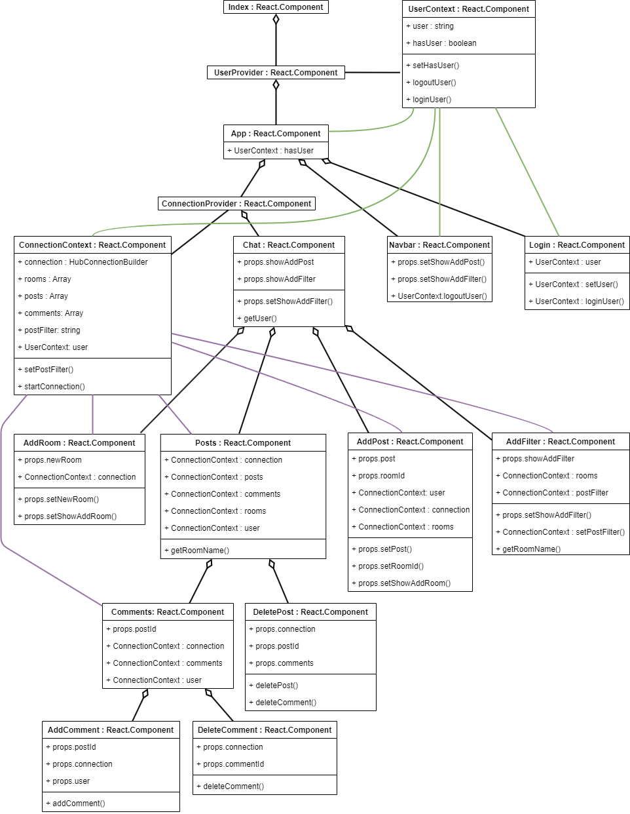
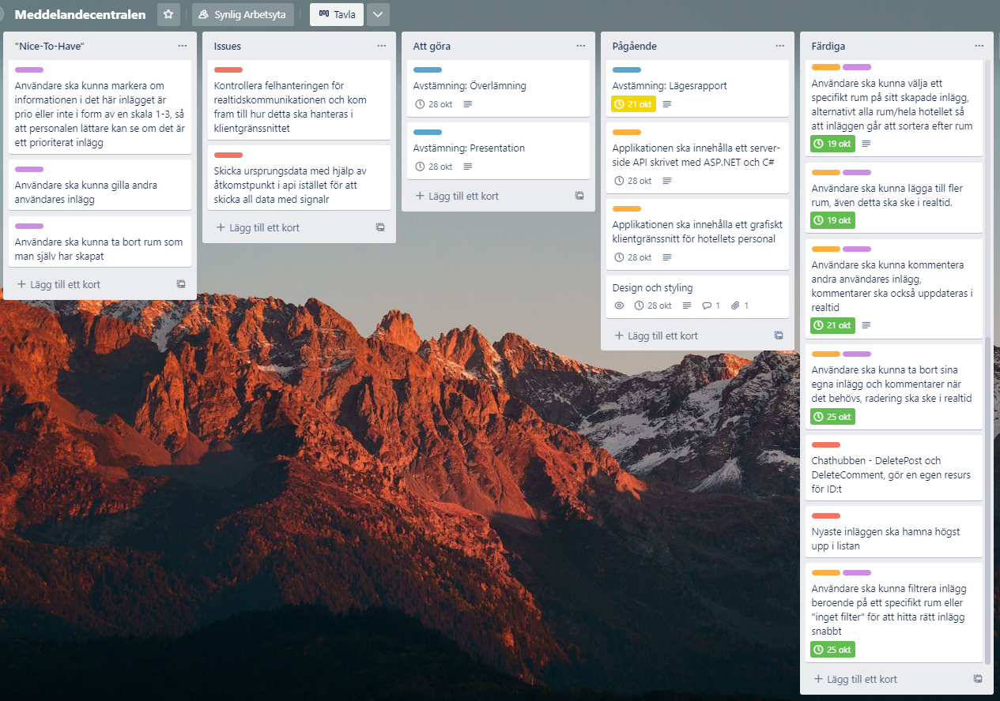

# Meddelandecentralen

**Twitter-liknande chatt-applikation byggd med .NET 6 och React. Realtidskommunikationen skapad med hjälp av SignalR.**

## Instruktioner

**Förbered och starta applikationen**

1. Ladda ner repot från https://github.com/jajo21/Meddelandecentralen.
2. Leta upp valfri terminal och utgå från nerladdad Meddelandecentralen mapp, navigera sedan in i mappen client via terminalen och skriv där: `npm ci ` nu laddas alla nödvändiga paket ner som behövs för att kunna köra klienten.
3. När alla paket har laddats klart skriver du i terminalen: `npm start`, det här startar både backend-api:et och klientgränssnittet.
4. Normalt ska programmet öppnas i din webbläsare, om det inte gör det, öppna valfri webbläsare och navigera in på http://localhost:5000/.

**Logga in**

1. Logga in genom att skriva valfritt användarnamn.
2. När du är inloggad kan du använda applikationen.

## Projektplan

Applikationen ska vara baserad på en av de fyra idéerna som finns i uppgiftsbeskrivningen. Jag har bestämt mig för att skapa nummer 3 "Något i stil med twitter, fast bara för de anställda på hotellet - också här är det viktigt att kunna sortera information per rum".

Min tanke är därför att skapa en plattform likt twitter där användare ska kunna skapa inlägg som resten av personalen på hotellet kan ta del av i realtid. Personal ska även kunna kommentera inlägg samt filtrera dessa inlägg efter rum.

Applikationen ska använda ramverket SignalR för realtidskommunikationen mellan klientgränssnittet och server-side API:et. Det grafiska klientgränssnittet kommer att byggas i React och server-side API:et kommer att byggas i ASP.NET Core och C#.

## Lägesrapport

### Klassdiagram över klientgränssnittet

_Vill också förtydliga att de olika färgerna på strecken från contexterna i diagrammet inte har någon betydelse i sig, dessa är endast färgade för att göra det lättare att visuellt tyda diagrammet._  
_(Tryck på bilden för att göra den större)_

### Kanban via trello - uppdaterad bild över projektets kanban-bräde

_Kolumnen "Färdiga" har fler kort än vad som är visuellt synligt på bilden, klicka vidare in på länken för att se alla kort._  
_(Tryck på bilden för att göra den större)_

### [Länk till kanban-tavlan](https://trello.com/b/SAuwn9pa/meddelandecentralen)
