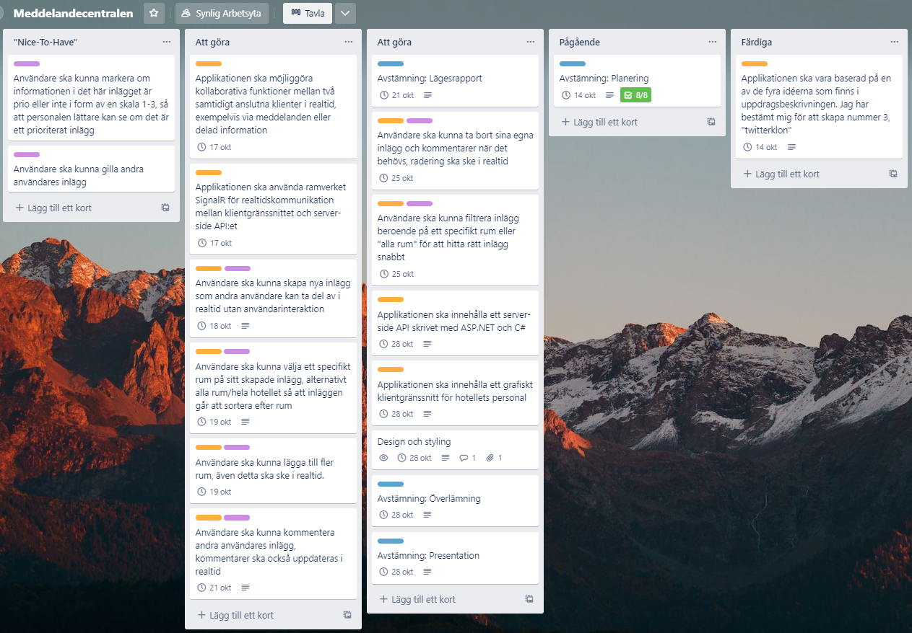

# Meddelandecentralen

## Projektplan

Applikationen ska vara baserad på en av de fyra idéerna som finns i uppgiftsbeskrivningen. Jag har bestämt mig för att skapa nummer 3 "Något i stil med twitter, fast bara för de anställda på hotellet - också här är det viktigt att kunna sortera information per rum."

Min tanke är därför att skapa en plattform likt twitter där användare ska kunna skapa inlägg som resten av personalen på hotellet kan ta del av i realtid. Personal ska även kunna kommentera inlägg samt filtrera dessa inlägg efter rum.

Applikationen ska använda ramverket SignalR för realtidskommunikationen mellan klientgränssnittet och server-side API:et. Det grafiska klientgränssnittet kommer att byggas i React och server-side API:et kommer att byggas i ASP.NET Core och C#.

### Inledande planering - kanban via trello

_(Tryck på bilden för att göra den större)_

  

### [Länk till kanban-tavlan](https://trello.com/b/SAuwn9pa/meddelandecentralen)
---
